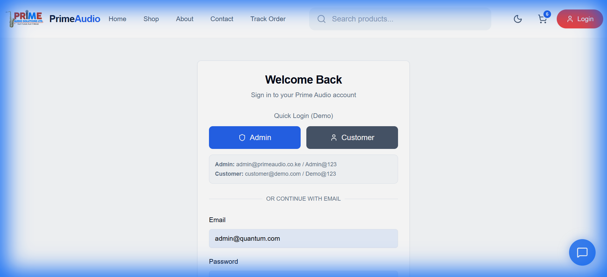

# Prime Audio - Premier Audio Equipment E-Commerce

> **Live Demo:** [https://prime-audio-web-app-mzss.vercel.app](https://prime-audio-web-app-mzss.vercel.app)  
> **Backend API:** [https://primeaudio-backend.onrender.com](https://primeaudio-backend.onrender.com) (Example)

**Prime Audio** is a high-performance e-commerce platform dedicated to professional audio equipment. Built with a modern tech stack, it features a seamless shopping experience, real-time product filtering, and a robust offline fallback system.

## 📸 visual Proof

The following screenshots demonstrate the application running in **Offline Mode (JSON Fallback)**, ensuring zero downtime even when the primary database is unreachable.

| Homepage | Shop Grid |
|----------|-----------|
|  |  |

| Login (Read-Only) |
|-------------------|
|  |

---

## 🚀 Key Features

*   **Responsive Modern UI**: Built with React 18, TailwindCSS, and Framer Motion for smooth animations.
*   **Robust Backend**: FastAPI (Python) backend serving specific endpoints for Products, Categories, Offers, and Testimonials.
*   **JSON Fallback System**: A custom-built reliability layer. If Firebase Quota is exceeded, the system automatically (or manually) switches to a local JSON file database.
*   **Real-time Search & Filter**: Instant product filtering by category, brand, and search terms.
*   **Cart & Wishlist**: Fully functional shopping cart with state persistence.

## 🛠️ Tech Stack

**Frontend:**
*   React 18 + Vite
*   Tailwind CSS + Headless UI
*   React Router v6
*   Framer Motion

**Backend:**
*   FastAPI (Python 3.10+)
*   Firebase Firestore (Primary DB)
*   **JSON Fallback Engine** (Secondary DB)
*   Uvicorn / Gunicorn

---

## 🛡️ The JSON Fallback System

We encountered a common issue during development: **Firebase Daily Quota Exhaustion**. To solve this, we architected a fallback mechanism.

### How it Works
1.  **Automatic Failover**: APIs wrap Firebase calls in `try/except` blocks. If a quota error occurs, the system catches it and redirects the request to the `fallback_data.py` handler.
2.  **Manual Override**: By setting `FIREBASE_AVAILABLE=false` in the backend environment variables, we can force the system into **"Offline Mode"**.
3.  **Data Source**: A curated set of JSON files in `backend/cache_data/` serves as the read-only database, providing full content (Products, Categories, Testimonials) without touching Firebase.

**Environment Variable controls:**
```bash
# backend/.env
FIREBASE_AVAILABLE=false  # Forces JSON Fallback (Safe Mode)
FIREBASE_AVAILABLE=true   # Tries Firebase first (Standard Mode)
```

---

## 📦 Setup Instructions

### 1. Backend Setup
```bash
cd backend
python -m venv venv
# Windows
.\venv\Scripts\activate
# Mac/Linux
source venv/bin/activate

pip install -r requirements.txt
uvicorn main:app --reload
```

### 2. Frontend Setup
```bash
cd frontend
npm install
npm run dev
```
Access the app at `http://localhost:5173`.

---

## ☁️ Deployment

### Vercel (Frontend)
*   Configured with `vercel.json` for SPA routing.
*   Environment Variable: `VITE_API_URL` pointing to your Render backend.

### Render (Backend)
*   **Build Command**: `pip install -r requirements.txt`
*   **Start Command**: `uvicorn main:app --host 0.0.0.0 --port $PORT`
*   **Environment Variable**: `FIREBASE_AVAILABLE=false` (To enable robust demo mode).

---

© 2024 Prime Audio Solutions. All rights reserved.
